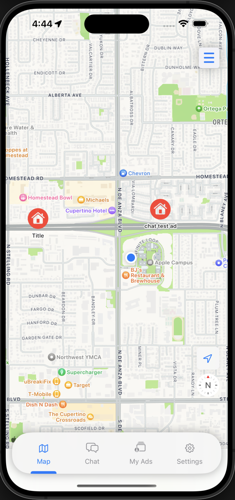
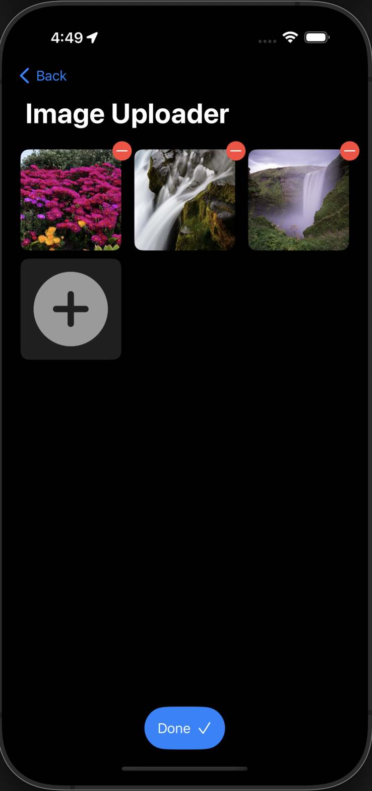
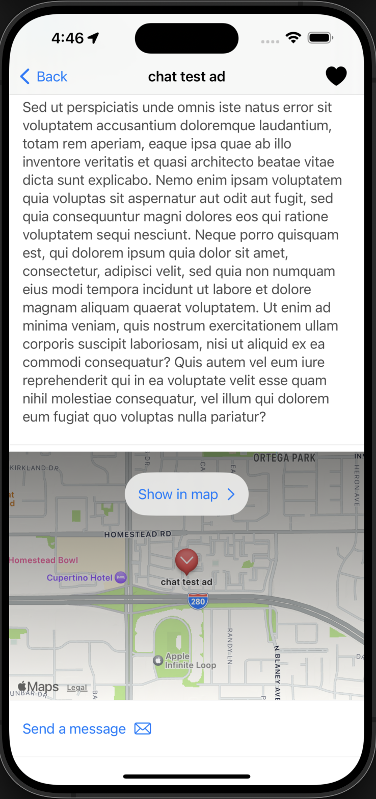

# QuestBoard

This project is the SwiftUI code for the QuestBoard application. It is an application (developed mainly to learn and experiment with swiftui) to help people advertise small tasks/jobs that they need done and for others to find jobs to do.

## Table of Contents

1. [Introduction](#introduction)
2. [Features](#features)
3. [Getting Started](#getting-started)
    - [Tech Stack ](#tech-stack)
    - [Prerequisites](#prerequisites)
    - [Installation](#installation)
4. [Usage](#usage)
    - [Screenshots](#screenshots)
        - [Home](#home)
        - [Profile](#profile)
        - [Create Job](#create-job)
        - [Job Details](#job-details)
        - [Job List](#job-list)
        - [Chat](#chat)
5. [Contributing](#contributing)
6. [License](#license)

## Introduction


## Getting Started

### Tech Stack 
- SwiftUI ( IOS 17+ )
- MapKit ( IOS 17+ )
- MongoDB
- ExpressJS
- NodeJS (TypeScript)
- Docker (For containerization)
- AWS EC2 (For hosting backend)
- AWS S3 (For image storage)
- Google Firebase Authentication
- Google Firestore  (For chat functionality)

### Prerequisites

- IOS 17.0+
- Xcode 12.0+
- Swift 5.0+

### Installation

Check out the backend code for this application [here](
    https://github.com/cem-dedetas/QuestBoardAPI.git
)

IOS application is not yet available on the app store. To run the application, clone the repository and open the project in Xcode. Then, run the application on a simulator or a physical device.

```bash
git clone https://github.com/cem-dedetas/QuestBoard.git
```


## Usage

### Screenshots
#### Home

<div style="display:flex margin-top:30px">


</div>

<div style="display:flex margin-top:30px">


</div>

<div style="display:flex margin-top:30px">


</div>

<div style="display:flex margin-top:30px">


</div>


#### Profile

<div style="display:flex margin-top:30px">


</div>
<div style="display:flex margin-top:30px">


#### Create Job

<div style="display:flex margin-top:30px">


</div>

<div style="display:flex margin-top:30px">


</div>

<div style="display:flex margin-top:30px">


</div>

<div style="display:flex margin-top:30px">


</div>


#### Job Details

<div style="display:flex margin-top:30px">


</div>

<div style="display:flex margin-top:30px">


</div>

#### Job List

<div style="display:flex margin-top:30px">


</div>

<div style="display:flex margin-top:30px">


</div>


#### Chat

<div style="display:flex margin-top:30px">


</div>


<div style="display:flex margin-top:30px">


</div>


## Contributing

Create an issue or submit a pull request. All contributions are welcome.

## License

This project is licensed under the MIT License - see the [LICENSE](LICENSE) file for details.
